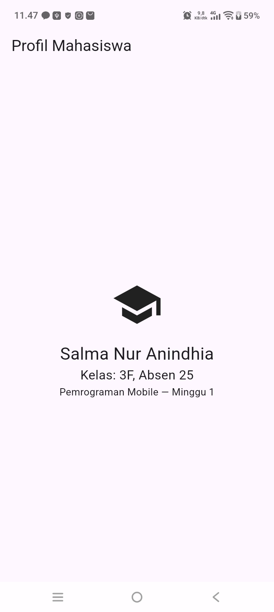

# Catatan Konsep — Week 1: Mobile Development Ecosystem & Flutter Refresh

## Arsitektur Flutter dan Peran Dart

Flutter tersusun dari 3 lapisan utama:
- **Framework** — berisi widget dan API yang dipakai developer untuk membangun UI dan logika aplikasi (ditulis dalam Dart).
- **Engine** — menangani rendering, teks, dan grafis level rendah.
- **Embedder** — menjembatani aplikasi Flutter dengan platform target (Android, iOS, web, atau desktop).

Dart berperan sebagai bahasa utama Flutter, mendukung dua mode kompilasi:
- **JIT (Just-In-Time)** — dipakai saat development, mendukung hot reload karena kompilasi cepat.
- **AOT (Ahead-Of-Time)** — dipakai saat build rilis, menghasilkan performa lebih optimal untuk production.

## Widget Tree dan Struktur Proyek

Flutter menggunakan pendekatan **UI deklaratif** — UI menggambarkan tampilan berdasarkan state saat ini, bukan diubah manual langkah demi langkah. Semua elemen visual di Flutter adalah **widget**, disusun berbentuk pohon (tree), contoh:

Struktur folder proyek Flutter standar:
- `lib/` — kode aplikasi, titik masuk utama di `lib/main.dart`.
- `test/` — unit test dan widget test.
- `android/`, `ios/`, `web/` — konfigurasi khusus tiap platform target.
- `pubspec.yaml` — metadata proyek, dependency, aset, dan versi SDK.

## Hot Reload dan Hot Restart

| Fitur | Fungsi | Kapan dipakai |
|---|---|---|
| **Hot reload** | Memasukkan perubahan kode tanpa menghapus state aplikasi | Iterasi cepat saat mengubah tampilan/UI |
| **Hot restart** | Menjalankan ulang aplikasi dari awal, state hilang | Saat perubahan tidak bisa diterapkan lewat hot reload, misal perubahan inisialisasi aplikasi |

**Perbedaan intinya:** hot reload mempertahankan state (misal counter yang sedang jalan tetap di angka yang sama), sementara hot restart mengembalikan aplikasi ke kondisi awal sepenuhnya.

## Refleksi

- **Kapan native lebih tepat dipilih daripada cross-platform?** Saat butuh performa maksimal atau akses langsung ke fitur perangkat spesifik yang belum tentu didukung framework cross-platform, atau kalau target cuma 1 platform.
- **Bagaimana perubahan state berhubungan dengan widget tree dan UI deklaratif?** UI adalah fungsi dari state saat state berubah, Flutter otomatis rebuild bagian widget tree yang terkait, tanpa developer harus manual ubah elemen satu-satu.
- **Mengapa commit kecil dengan pesan jelas bermanfaat bagi pekerjaan tim dan portfolio?** Karna memudahkan tracking perubahan dan debugging, serta jadi bukti proses kerja yang rapi dan mudah dipahami orang lain.

## Screenshoot
- 