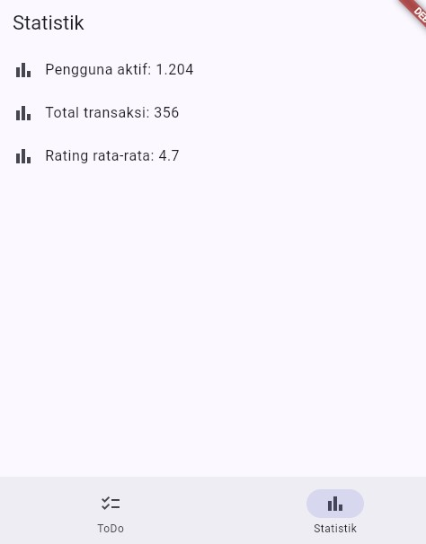

# Week 3 — Navigation & State Management

Aplikasi ToDo Flutter dengan navigasi multi-page (GoRouter) dan state management (Riverpod), termasuk penanganan state asinkron (`AsyncValue`) untuk simulasi pengambilan data.

## Tujuan

Menerapkan navigasi deklaratif dengan GoRouter, mengelola state lintas halaman dengan Riverpod, dan menangani tiga kondisi state asinkron (loading, error, success) menggunakan `AsyncNotifier`/`AsyncValue`.

## Fitur Utama

- **Home** — daftar item, navigasi ke halaman Detail via path parameter (`/detail/:id`).
- **ToDo** (`/todo`) — tambah, centang (selesai), dan hapus tugas. State dikelola `Notifier` (Riverpod), UI otomatis ter-*rebuild* tiap state berubah.
- **Produk** (`/products`) — simulasi pengambilan data async (delay 2 detik), tombol refresh untuk memuat ulang data baru.
- **Statistik** (`/stats`) — simulasi data async dengan kemungkinan gagal 30%, menangani state loading (spinner), error (pesan + tombol *Coba lagi*), dan success (list 3 item).

## Stack Teknologi

- Flutter (Web)
- [go_router](https://pub.dev/packages/go_router) — navigasi deklaratif
- [flutter_riverpod](https://pub.dev/packages/flutter_riverpod) — state management


## Hasil yang Dicapai

- Navigasi GoRouter bekerja: pindah halaman, tombol back, dan akses path detail langsung via URL.
- `ProviderScope` membungkus root aplikasi; state ToDo bertahan saat berpindah halaman.
- UI `AsyncValue` menangani loading, error, dan success — dibuktikan pada halaman Produk dan Statistik.
- `flutter analyze` tanpa issue, seluruh test lulus.

## Checklist Verifikasi Mandiri

- [x] Navigasi GoRouter: pindah halaman, back, akses path detail langsung
- [x] `ProviderScope` membungkus root aplikasi; state ToDo bertahan saat berpindah halaman
- [x] UI AsyncValue menangani loading, error, dan success (bukan hanya success)
- [x] `flutter analyze` tanpa issue dan semua test lulus
- [x] Hasil AI diverifikasi dan didokumentasikan

## AI Verification Checklist (StatsPage)

Prompt, output AI, dan verifikasi lengkap ada di folder `docs/`. Ringkasan:

1. **Immutability** — ✅ state selalu diassign ulang (`state = ...`), tidak ada mutasi list langsung.
2. **watch/read** — ✅ `ref.watch` dipakai di `build`, `ref.read` di callback (tombol retry/refresh).
3. **Tiga state AsyncValue** — ✅ loading, error, dan success semuanya ditangani lewat `.when()`.
4. **Provider eksplisit, tidak duplikat** — ✅ `AsyncNotifierProvider<StatsNotifier, List<String>>`, nama unik.
5. **API modern** — ✅ pakai `AsyncNotifier`/`AsyncNotifierProvider`, bukan `StateProvider`/`StateNotifierProvider` usang.
6. **`flutter analyze` & `flutter test`** — ✅ lolos tanpa warning.


## Screenshots

### GoRouter


### State management dengan Riverpod


### AsyncValue


### AI Challenge


## Refactoring dan testing
### 1. Ekstrak TodoTile menjadi widget terpisah
**`lib/widgets/todo_tile.dart`**
```dart
import 'package:flutter/material.dart';
import 'package:flutter_riverpod/flutter_riverpod.dart';
import '../providers/todo_provider.dart';

class TodoTile extends ConsumerWidget {
  final Todo todo;
  final int index;

  const TodoTile({super.key, required this.todo, required this.index});

  @override
  Widget build(BuildContext context, WidgetRef ref) {
    return ListTile(
      leading: Checkbox(
        value: todo.done,
        onChanged: (_) => ref.read(todoListProvider.notifier).toggle(index),
      ),
      title: Text(
        todo.title,
        style: TextStyle(
          decoration: todo.done ? TextDecoration.lineThrough : null,
        ),
      ),
      trailing: IconButton(
        icon: const Icon(Icons.delete),
        onPressed: () => ref.read(todoListProvider.notifier).remove(index),
      ),
    );
  }
}
```

### 2. Mengekstrak logika 


### 3. Integrasikan aplikasi ToDo dengan GoRouter untuk daftar dan untuk halaman statistik


### 4. Testing


## Refleksi

**Kenapa stale data + indikator refresh kadang lebih baik daripada layar kosong?**
Menampilkan data lama sambil menandai "sedang refresh" (misal spinner kecil, bukan layar kosong penuh) membuat user tetap bisa lihat & pakai data yang ada sambil menunggu data baru datang — pengalaman terasa lebih responsif dan tidak "flicker". Pola ini penting di kasus seperti daftar chat, feed, atau dashboard yang sering di-refresh: kalau tiap refresh layar dikosongkan dulu, user kehilangan konteks dan UI terasa patah-patah.

**Kapan `setState` masih cukup, kapan harus naik ke Riverpod?**
`setState` cukup kalau state itu murni lokal — cuma dipakai & diubah di satu widget itu sendiri (animasi, toggle expand/collapse, input form sementara). Begitu state perlu dibaca/diubah dari lebih dari satu halaman/widget yang tidak bertetangga langsung, `setState` memaksa prop drilling — di titik ini state sebaiknya dipindah ke Riverpod supaya bisa diakses lewat `ref` dari mana saja.

**Beda `context.go` dan `context.push`?**
`context.go()` **mengganti** lokasi di stack (route sebelumnya hilang) — cocok untuk navigasi utama/tab atau redirect (misal habis login). `context.push()` **menumpuk** route baru di atas stack yang ada — cocok untuk alur "buka detail lalu bisa back", karena halaman sebelumnya tetap ada di stack.

**Bagaimana `AsyncValue` mencegah bug dibanding tiga boolean terpisah?**
Dengan `isLoading`, `hasError`, `hasData` sebagai tiga boolean terpisah, kombinasi yang tidak valid bisa terjadi tanpa disadari. `AsyncValue<T>` memaksa hanya satu state yang mungkin aktif dalam satu waktu, dan lewat `.when()` semua cabang wajib ditangani — bug "lupa handle error" jadi jauh lebih sulit terjadi.

**Bagian mana dari hasil AI yang diperbaiki, dan mengapa?**
Kode AI untuk `StatsPage` sudah memakai pola `AsyncNotifier` yang benar, tapi unit test awal langsung meng-`expect` hasil sukses tanpa mempertimbangkan kemungkinan gagal 30%, sehingga test menjadi flaky (timeout saat kebetulan skenario gagal terpicu). Perbaikan dilakukan dengan menambahkan `try/catch` pada test agar kedua kemungkinan hasil (sukses maupun error) ditangani dengan benar.