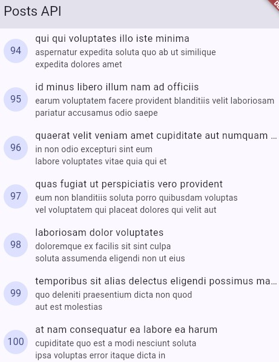
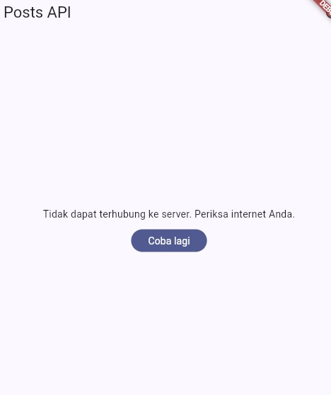
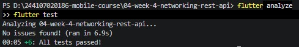

# Minggu 4: Networking & REST API (Flutter)

## Tujuan

- Memahami konsep HTTP, REST API, dan JSON.
- Memetakan JSON ke model Dart dengan aman null.
- Menerapkan repository pattern agar UI tidak memanggil API secara langsung.
- Mengonfigurasi Dio (base URL, timeout, interceptor) dan menangani error jaringan.
- Menampilkan state loading, error, empty, dan success dengan `AsyncValue` + Riverpod.
- Menerapkan pagination dasar (infinite scroll).

## Fitur Utama

1. **Daftar post** dari `GET /posts` (100 data) dengan pull-to-refresh dan tombol refresh.
2. **Empat state UI:** loading, error (pesan ramah pengguna + tombol "Coba lagi"), empty, dan success.
3. **Infinite scroll** dengan `?_page=N&_limit=10`, dilengkapi guard agar tidak terjadi request ganda dan indikator akhir data.
4. **Halaman detail** (`/post/:id`) dengan GoRouter. Data diambil dari list yang sudah dimuat, atau lewat repository jika halaman dibuka langsung.
5. **Dio terpusat:** base URL, timeout 10 detik, dan interceptor logging di satu tempat.
6. **Model `fromJson` aman null** sehingga tidak crash saat field hilang atau tipe berubah.
7. **Pesan error ramah pengguna** untuk timeout, gagal koneksi, 401/403, 404, dan error server.
8. **Hasil AI Challenge:** repository layer untuk endpoint `/comments` (lihat folder `docs/`).

## Hasil

### Daftar post (success)

> 📸 Tampilan daftar 100 post setelah data berhasil dimuat.

### State loading

> 📸 Tampilan `CircularProgressIndicator` saat data sedang diambil.

### State error dan tombol "Coba lagi"

> 📸 Matikan internet (mode pesawat), tekan refresh, lalu tangkap pesan error dan tombol "Coba lagi".

### Error baseUrl salah

> 📸 Mengubah `baseUrl` sementara ke URL salah, hasilnya sama seperti yg diatas.

> 📸 Scroll sampai habis sampai muncul teks "Semua data termuat."

### Hasil `flutter analyze` dan `flutter test`

> 📸 Terminal yang menunjukkan `No issues found!` dan `All tests passed!`.

## Pengujian

Test ada di `test/post_test.dart` dan semuanya berjalan tanpa internet (memakai `FakePostRepository`). Hasil terakhir `flutter test`: 

| Test | Yang diuji |
| --- | --- |
| `fromJson` field hilang | `Post.fromJson({'id': 7})` menghasilkan `title` kosong dan `userId` 0 tanpa crash |
| Pesan error | `friendlyErrorMessage` untuk `connectionError` memuat kata "terhubung" |
| Provider sukses | `postListProvider` dengan repository palsu menghasilkan data yang benar |
| Provider error | `postListProvider` dengan repository palsu melempar `DioException` |
| [ISI] | Test tambahan (misal test AI Challenge atau edge case buatan sendiri) |

## AI Challenge

Prompt, output awal AI, perbaikan yang dilakukan, dan hasil testing didokumentasikan di folder [`docs/`](docs/).

| Item | File |
| --- | --- |
| Prompt yang digunakan | `docs/01-prompt.md` |
| Output awal AI | `docs/02-output-awal-ai.md` |
| Perbaikan dan alasan | `docs/03` |
| Hasil testing | `docs/[ISI NAMA FILE]` |

## Refactoring

Tiga refactoring yang dikerjakan setelah aplikasi berjalan:

1. **`PostTile`** diekstrak ke `lib/widgets/post_tile.dart` agar `ListView.builder` pendek dan dipakai ulang di halaman list dan paged.
2. **`friendlyErrorMessage`** dipindah ke `lib/data/network_errors.dart` agar bisa dipakai bersama oleh semua halaman.
3. **Halaman detail** `/post/:id` ditambahkan dengan GoRouter. Datanya diambil dari list yang sudah dimuat, atau lewat `postDetailProvider` bila halaman dibuka langsung.

## Refleksi

### 1. Mengapa UI dilarang memanggil Dio langsung?

Agar logika jaringan (URL, timeout, parsing, error) tidak bercampur dengan tampilan. Kalau dilanggar:

- **Sulit diuji:** test butuh internet atau mock Dio yang rumit. Dengan repository cukup override provider dengan `FakePostRepository`.
- **Sulit diubah:** ganti `baseUrl` atau sumber data berarti mengubah banyak widget.
- **Kode berulang dan tidak konsisten:** try/catch, parsing, dan pesan error ditulis ulang di tiap widget.

### 2. Pagination client-side vs server

- **Client-side cukup** untuk data kecil (puluhan sampai ratusan item) yang memang datang sebagai satu respons.
- **Server (`_page`/`_limit`) wajib** untuk data besar atau terus bertambah: loading awal cepat, hemat kuota dan memori. Kalau API mendukung, selalu pakai.

### 3. Dari exception repository ke `AsyncError`

Repository tidak menelan exception, jadi `DioException` naik ke `build()` pada `AsyncNotifier`. Riverpod menangkapnya dan mengubah state menjadi `AsyncError`, lalu UI tinggal menyediakan cabang `error:` di `.when(...)`.

Try/catch eksplisit tetap perlu saat `state` diatur manual di luar `build()`, seperti `refresh()`, `loadFirstPage()`, dan `loadNextPage()` (agar data lama tetap tampil saat error).

### 4. Bagian hasil AI yang saya perbaiki

- **`fromJson` crash pada tipe salah.** Versi AI memakai `as num?` dan `as String?`, yang aman untuk field hilang tapi melempar exception kalau tipe salah. Ditemukan lewat test edge case buatan sendiri (`type 'String' is not a subtype of type 'num?'`). Diganti dengan pengecekan `is` (`id is num ? id.toInt() : 0`).
- **Timeout tersebar.** AI menambahkan `Options(sendTimeout, receiveTimeout)` di `fetchComments`, padahal `createDio()` sudah mengatur timeout 10 detik. Dihapus agar terpusat di satu tempat.
- **Pesan error duplikat.** `commentErrorMessage` hampir sama dengan `friendlyErrorMessage`. Disatukan di `network_errors.dart`, dan komentar hanya mengganti pesan 404 lewat parameter.

## Checklist Verifikasi Mandiri

- [x] UI tidak memanggil Dio langsung, semua akses data lewat repository + provider.
- [x] Empat state tampil benar: loading, error (+ retry), empty, success.
- [x] Pagination: data bertambah saat scroll, tidak ada request ganda, ada indikator akhir data.
- [x] `flutter analyze` tanpa issue **(centang setelah hasil terakhir benar-benar bersih)**
- [x] Semua test lulus.
- [x] Hasil AI diverifikasi dan didokumentasikan di folder `docs/` 
